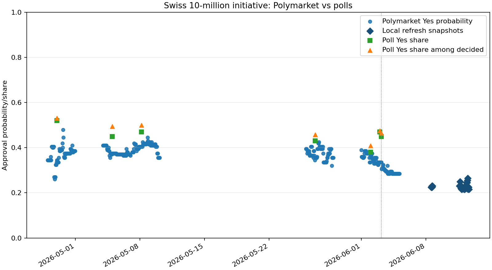
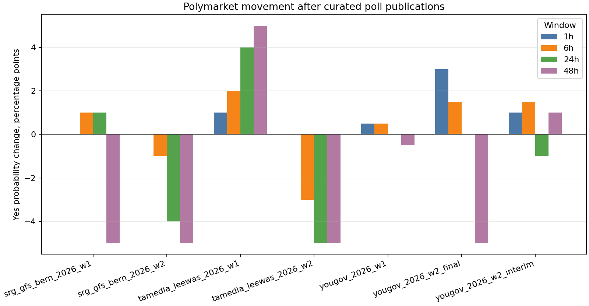
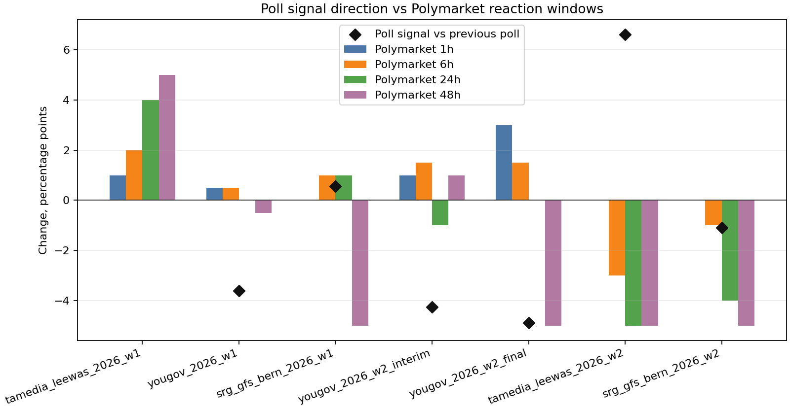

# Swiss 10-Million Referendum Latest Summary

## Generated Or Inspected

- Comparison rows: 43.
- Polymarket snapshot rows: 43.
- Bounded price-history rows: 504.
- Curated poll rows: 7 from SRG/gfs.bern, Tamedia/20 Minuten/LeeWas, YouGov Schweiz.
- Poll-impact rows: 7 (observed_pre_post: 7).
- Poll reaction-window rows: 28.
- Information-response rows: 7.
- Poll reaction windows: 1h: latest observed +0.0 pp; 6h: latest observed -1.0 pp; 24h: latest observed -4.0 pp; 48h: latest observed -5.0 pp.
- Latest poll-source comparison rows: 3.
- Source-audit rows: 9.

## Poll Release Timing Summary

- tamedia_leewas_2026_w1 (Tamedia/20 Minuten/LeeWas, 2026-04-29T00:00:00Z): first post observation after 0.2 min, first change +1.0 pp; windows 1h +1.0 pp, 6h +2.0 pp, 24h +4.0 pp, 48h +5.0 pp; status observed_pre_post; descriptive no-causality scope.
- yougov_2026_w1 (YouGov Schweiz, 2026-05-05T00:00:00Z): first post observation after 0.3 min, first change +0.5 pp; windows 1h +0.5 pp, 6h +0.5 pp, 24h +0.0 pp, 48h -0.5 pp; status observed_pre_post; descriptive no-causality scope.
- srg_gfs_bern_2026_w1 (SRG/gfs.bern, 2026-05-08T03:56:00Z): first post observation after 4.1 min, first change +0.0 pp; windows 1h +0.0 pp, 6h +1.0 pp, 24h +1.0 pp, 48h -5.0 pp; status observed_pre_post; descriptive no-causality scope.
- yougov_2026_w2_interim (YouGov Schweiz, 2026-05-27T00:00:00Z): first post observation after 0.1 min, first change +1.0 pp; windows 1h +1.0 pp, 6h +1.5 pp, 24h -1.0 pp, 48h +1.0 pp; status observed_pre_post; descriptive no-causality scope.
- yougov_2026_w2_final (YouGov Schweiz, 2026-06-02T00:00:00Z): first post observation after 0.1 min, first change +3.0 pp; windows 1h +3.0 pp, 6h +1.5 pp, 24h +0.0 pp, 48h -5.0 pp; status observed_pre_post; descriptive no-causality scope.
- tamedia_leewas_2026_w2 (Tamedia/20 Minuten/LeeWas, 2026-06-03T00:00:00Z): first post observation after 0.1 min, first change +0.0 pp; windows 1h +0.0 pp, 6h -3.0 pp, 24h -5.0 pp, 48h -5.0 pp; status observed_pre_post; descriptive no-causality scope.
- srg_gfs_bern_2026_w2 (SRG/gfs.bern, 2026-06-03T03:55:00Z): first post observation after 5.0 min, first change +0.0 pp; windows 1h +0.0 pp, 6h -1.0 pp, 24h -4.0 pp, 48h -5.0 pp; status observed_pre_post; descriptive no-causality scope.

## Latest Poll-Source Comparison

- SRG/gfs.bern: srg_gfs_bern_2026_w2 published 2026-06-03T03:55:00Z; poll Yes 45.0%, decided Yes 46.4%, raw gap -23.5 pp, decided gap -24.9 pp; below_poll_proxy.
- Tamedia/20 Minuten/LeeWas: tamedia_leewas_2026_w2 published 2026-06-03T00:00:00Z; poll Yes 47.0%, decided Yes 47.5%, raw gap -25.5 pp, decided gap -26.0 pp; below_poll_proxy.
- YouGov Schweiz: yougov_2026_w2_final published 2026-06-02T00:00:00Z; poll Yes 38.0%, decided Yes 40.9%, raw gap -16.5 pp, decided gap -19.4 pp; below_poll_proxy.

## Information Response Summary

- Processing-label counts: delayed_same_direction_24h: 1, delayed_same_direction_48h: 2, delayed_same_direction_6h: 2, no_prior_poll_signal: 1, no_same_direction_within_48h: 1.
- tamedia_leewas_2026_w1: poll signal no_prior_poll (not classified); first Polymarket observation after 0.2 min, first change +1.0 pp; 1h +1.0 pp, 6h +2.0 pp, 24h +4.0 pp, 48h +5.0 pp; no_prior_poll_signal.
- yougov_2026_w1: poll signal down (-3.6 pp); first Polymarket observation after 0.3 min, first change +0.5 pp; 1h +0.5 pp, 6h +0.5 pp, 24h +0.0 pp, 48h -0.5 pp; delayed_same_direction_48h.
- srg_gfs_bern_2026_w1: poll signal up (+0.5 pp); first Polymarket observation after 4.1 min, first change +0.0 pp; 1h +0.0 pp, 6h +1.0 pp, 24h +1.0 pp, 48h -5.0 pp; delayed_same_direction_6h.
- yougov_2026_w2_interim: poll signal down (-4.3 pp); first Polymarket observation after 0.1 min, first change +1.0 pp; 1h +1.0 pp, 6h +1.5 pp, 24h -1.0 pp, 48h +1.0 pp; delayed_same_direction_24h.
- yougov_2026_w2_final: poll signal down (-4.9 pp); first Polymarket observation after 0.1 min, first change +3.0 pp; 1h +3.0 pp, 6h +1.5 pp, 24h +0.0 pp, 48h -5.0 pp; delayed_same_direction_48h.
- tamedia_leewas_2026_w2: poll signal up (+6.6 pp); first Polymarket observation after 0.1 min, first change +0.0 pp; 1h +0.0 pp, 6h -3.0 pp, 24h -5.0 pp, 48h -5.0 pp; no_same_direction_within_48h.
- srg_gfs_bern_2026_w2: poll signal down (-1.1 pp); first Polymarket observation after 5.0 min, first change +0.0 pp; 1h +0.0 pp, 6h -1.0 pp, 24h -4.0 pp, 48h -5.0 pp; delayed_same_direction_6h.

## Key Numerical Result

- Latest snapshot: 2026-06-12T16:04:17Z.
- Latest matched poll: srg_gfs_bern_2026_w2 (SRG/gfs.bern).
- Polymarket Yes probability: 21.5%.
- Latest poll Yes share: 45.0%.
- Latest poll decided Yes share: 46.4%.
- Raw Yes gap: -23.5 pp.
- Decided Yes gap: -24.9 pp.
- Poll-proxy relation: below_poll_proxy.

## Bounded Interpretation

- The latest local Polymarket Yes probability is below the latest curated poll Yes share under the deterministic poll-proxy label. This is a descriptive comparison only.

## Main Limitation

- Poll shares are survey shares, not model-implied win probabilities. The decided-voter value is only yes_share / (yes_share + no_share). Poll-impact rows describe first observable pre/post Polymarket points and do not identify causality, market efficiency, tradeability, or true mispricing.

## Figure

## Reaction Window Figure

## Information Response Figure

## Source Boundary

- BFS/admin.ch rows are context sources only. Current voting-intention poll inputs are SRG/gfs.bern, Tamedia/LeeWas, and YouGov Schweiz rows in the curated poll catalog.

## Local Artifacts

- Dashboard: `data\results\swiss_referendum_10mio_dashboard.html`.
- Figure: `data\results\swiss_referendum_10mio_efficiency.png`.
