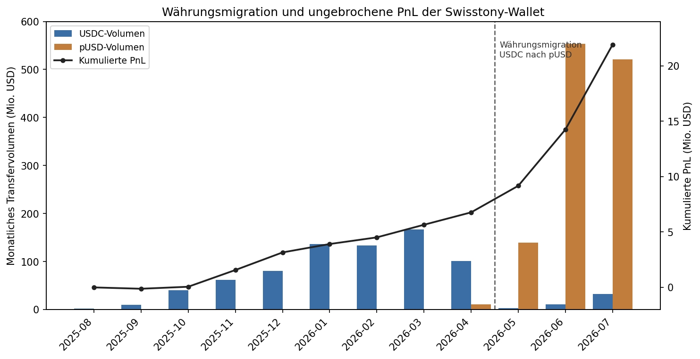

# On-Chain Trader Verification: Methoden-Fallstudie

Status: Entwurf zur BA-Integration (2026-07-23). Uebergabe-Dokument aus einer Recherche-Session im Repo `prediction-market-terminal`. Vor Uebernahme in den Fliesstext: Guardrails pruefen (siehe Abschnitt "Begrenzte Interpretation") und Wallet pseudonymisieren (im Text durchgaengig "Wallet W", Klartext-Adresse nur im Reproduzierbarkeits-Block). Achtung: Dieses Dokument enthaelt eine Klartext-Wallet-Adresse und darf nicht in ein oeffentlich einsehbares Repository committed werden.

Andockpunkte in der Kapitelstruktur: primaer `03_methodik.tex` (On-Chain-Verifikationstechnik) und `07_erweiterungen.tex` (Copytrading-Feature als getestete Strategie), sekundaer `10_einschraenkungen.tex` (Limitationen der Metrik). Der Fall ist ein Methoden- und Prozessbeispiel, kein H1/H2/H3-Ergebnis.

---

## Zweck und Einordnung

Diese Fallstudie dokumentiert eine Recherche-Technik, nicht ein Handelsergebnis: wie sich die oeffentlich gemeldeten Kennzahlen eines auffaellig profitablen Polymarket-Traders anhand oeffentlicher Blockchain-Daten unabhaengig verifizieren lassen, welche systematischen Fehlerquellen dabei auftreten, und wie aus dem Verifikationsversuch das Copytrading-Feature des Terminals entstand, dessen zugrunde liegende Strategie sich anschliessend als unterlegen zeigte.

Der wissenschaftliche Beitrag liegt in drei Punkten. Erstens ein reproduzierbares Verfahren zur On-Chain-Rekonstruktion von Kapitalfluessen. Zweitens eine Belegkette, dass die Polymarket-Profit-Metrik cash-genau ist, gestuetzt auf zwoelf Kontroll-Wallets. Drittens eine transparente Dokumentation der iterativen Fehlerkorrektur, die die Datenqualitaet erst herstellt.

---

## Untersuchte Datengrundlage (Generated Or Inspected)

- Vollstaendiger On-Chain-Ledger der Referenz-Wallet W ueber beide Handelswaehrungen: 5.689.590 ERC-20-Transfers (USDC 3.365.174 Zeilen, 52 Gegenparteien; pUSD 2.324.416 Zeilen, 7.862 Gegenparteien). Quelle: Etherscan V2 Multichain-API, Polygon (chainid 137), read-only.
- Gegenprobe der Positionstoken: 941.432 ERC-1155-Transfers (August 2025 bis Januar 2026), plus Stichprobenfenster fuer die uebrigen Monate 2026.
- Kontrollgruppe zur Metrik-Validierung: zwoelf weitere Leaderboard-Wallets (Raenge etwa 10 bis 22), vollstaendig ueber Etherscan gescannt.
- Offizielle Kennzahlen: Polymarket Leaderboard (`lb-api.polymarket.com`), PnL-Kurve (`user-pnl-api.polymarket.com`, 348 Tagespunkte), Positions- und Aktivitaets-Feeds (`data-api.polymarket.com`).
- Anonymisiertes Handels-Tape der Wallet W aus dem lokalen Copytrading-Paper-Lauf (`data/copy_trading.sqlite`): rund 204.600 kopierbare Kaeufe in 10.509 aufgeloesten Maerkten.
- Zeitraum: erster Trade laut PnL-Kurve am 2025-08-10, erster On-Chain-Transfer bereits am 2025-08-07, letzte erfasste Transfers am 2026-07-23. Ledger-Spanne rund 350 Tage.

---

## Forschungsdynamik: der Ablauf

Der Kern dieser Fallstudie ist der Weg, nicht nur das Ergebnis. Die Verifikation verlief in Runden, jede korrigierte einen Fehler der vorigen. Der dokumentierte Fehler-und-Korrektur-Zyklus ist selbst das Methodenergebnis.

1. **Ausgangsbeobachtung.** Das Leaderboard weist Wallet W als Rang 1 nach Handelsvolumen (rund 1,72 Mrd. USD) und Rang 2 nach Profit (rund 21,9 Mio. USD) aus. Die Frage war nicht, ob viel verdient wurde, sondern ob die Zahl unabhaengig belegbar ist und welchem Anteil sich der gemessene Vorteil zuordnen laesst.

2. **Erste Hypothese aus Aggregaten, verworfen.** Aus Volumen, Positionsgroesse und Anzahl offener Positionen wurde zunaechst auf Market-Making geschlossen. Der Blick ins Tape widerlegte das: 488.870 Kaeufe gegen 3 Verkaeufe. Ein klassischer Market Maker quotet zweiseitig. Lehre: Aggregat-Indizien ersetzen keine Transaktionsdaten.

3. **Rollenklaerung ueber das Orderbuch.** Ein As-of-Join der Fills gegen den Buchstand unmittelbar davor zeigte, dass 65,9 Prozent der Ausfuehrungen am oder unter dem besten Gebot lagen. Die Wallet ist ueberwiegend die passive Seite. Auf Polymarket ist "Ja verkaufen" identisch mit "Nein kaufen", weshalb zweiseitige Liquiditaet im Feed wie reines Kaufen aussieht.

4. **Zerlegung des Vorteils.** Eine Aufspaltung des Edges in einen Ausfuehrungs- und einen Auswahlanteil ergab, dass der Ausfuehrungsanteil praktisch null ist (553 USD von 956.651 USD). Unter dem gewaehlten Messmodell ordnet die Zerlegung den gemessenen Vorteil damit dem Auswahlanteil zu und nicht dem Ausfuehrungsanteil.

5. **Zwei stille Messfehler, korrigiert.** Ein Labeling-Fehler wertete eine Nullbetrags-Ausbuchung faelschlich als Gewinn und drehte 387 Verlierer zu Gewinnern. Zusaetzlich fielen Maerkte, in denen nur die Verliererseite gehalten wurde, aus der Stichprobe. Beide Fehler schoenten den Vorteil. Nach Korrektur sank der gemessene Edge von 8,07 Prozent auf 1,56 Prozent, im Einklang mit dem 1,28-Prozent-Lifetime-Wert aus dem Leaderboard.

6. **Basisraten-Studie mit Stichprobenfehler.** Ein erster Lauf zog die ersten Ereignisse aus dem Tape, die zufaellig fast alle aus einem Grossereignis stammten, in dem die Wallet schlechter abschneidet. Die Korrektur auf eine geschichtete Zufallsstichprobe kehrte das Vorzeichen des Befunds um. Lehre: Reihenfolge im Tape ist keine Zufallsstichprobe.

7. **On-Chain-Rekonstruktion, vier Sackgassen.** Erstens lieferten freie RPC-Endpunkte die dichten Bloecke nicht. Zweitens deckte der Umstieg auf die Etherscan-API einen Pagination-Fehler auf: die Seitengroesse ist serverseitig auf 1.000 Zeilen begrenzt, ein kurzer Rueckgabewert ist also kein Ende der Historie. Der erste Lauf brach unbemerkt fruehzeitig ab und meldete eine plausible, aber falsche Zahl. Drittens waren die groessten Gegenparteien keine externen Einzahler, sondern Protokoll-Contracts (verifiziert per Bytecode-Abfrage), was eine Schein-Einzahlung von 211 Mio. USD erzeugt hatte. Viertens verwarf ein zu frueher Filter die Kaufseite des Handels und hinterliess eine Luecke von 15,6 Mio. USD gegenueber der Buchhaltungsidentitaet.

8. **Aufloesung.** Der vollstaendige, ungefilterte Scan schloss die Luecke: die Handelswaehrung wurde Ende April 2026 von USDC auf pUSD umgestellt. Ein USDC-Ledger verstummt daher mitten im Zeitraum, waehrend der Handel weiterlaeuft. Die Luecke von 15,6 Mio. USD deckt sich mit dem Profit nach der Umstellung, und die Wallet haelt rund 4,4 Mio. USD in pUSD, das ein USDC-Scan nicht sieht.

9. **Ausschluss der Alternativen.** Bevor die Waehrungsmigration als Erklaerung akzeptiert wurde, wurden zwei Gegenhypothesen widerlegt: ein vollstaendiger ERC-1155-Scan fand null Positionstoken an Nicht-Protokoll-Adressen, und zwoelf Kontroll-Wallets zeigten, dass die Metrik cash-genau ist (siehe unten).

---

## Kernzahlen der Verifikation (Key Numerical Result)

Die On-Chain-Werte stammen aus deterministischen Skript-Laeufen und sind aus den beiliegenden CSV-Artefakten reproduzierbar. Die mit API gekennzeichneten Werte stammen aus den Polymarket-Feeds bzw. aus Study- und Bootstrap-Skripten und sind ueber die genannten Snapshots reproduzierbar. Quell-Artefakte in Klammern.

- Gemeldeter Profit 21.945.916 USD, Handelsvolumen 1.721.787.743 USD (Leaderboard-API, Snapshot 2026-07-22).
- Risikokennzahlen aus der Tages-PnL-Kurve (`app/perf_metrics.py`, API-Snapshot 2026-07-22): Sharpe 3,19, Sortino 4,92, Calmar 11,11, maximaler Drawdown 2.084.428 USD bzw. 21,67 Prozent vom Hoch, Gewinntage 57,80 Prozent mit 95-Prozent-Intervall 52,54 bis 62,89. Diese Kennzahlen beschreiben die realisierte Vergangenheits-PnL einer einzelnen Wallet und erlauben keine Aussage ueber Replizierbarkeit oder kuenftige Ergebnisse.
- Trefferquote (korrigierte Label-Logik, Tape-Snapshot 2026-07-22): markt-gewichtet 85,67 Prozent (Intervall 84,99 bis 86,33; n gleich 10.509), fill-gewichtet 60,80 Prozent (Intervall 60,58 bis 61,01; n gleich 204.602).
- Realisierter Vorteil je eingesetztem Dollar, mit Bootstrap ueber ganze Maerkte (`app/perf_metrics.cluster_bootstrap_edge`): gesamt plus 1,56 Prozent mit Intervall minus 0,84 bis plus 3,96 (nicht signifikant); Teilsegment mit exakten Ergebniswetten plus 4,07 Prozent mit Intervall plus 2,61 bis plus 5,38 (signifikant); uebriger Handel minus 0,11 Prozent (nicht signifikant).
- On-Chain-Kapital (`app/onchain_flows.py`, `scripts/full_wallet_ledger.py`, Ledger-Snapshot 2026-07-23): externe Brutto-Einzahlung 3.581.762 USD, externe Brutto-Entnahme 30.264.984 USD, netto entnommen 26.683.222 USD. Restbestaende laut Ledger-Snapshot: 4.105 USDC plus rund 4.436.015 pUSD, dazu rund 162.000 in offenen Positionen; der pUSD-Bestand wandert laufend und ist als Momentaufnahme zu lesen.
- Metrik-Validierung (Kontrollgruppe, zwoelf Wallets der USDC-Aera): Verhaeltnis von gemeldetem Profit zu On-Chain-Cashflow zwischen 0,9944 und 1,0141, Median 1,0011. Die Leaderboard-Zahl ist damit cash-genau und nicht systematisch aufgeblasen.

---

## Vom Verifikationsfall zum Copytrading-Feature

Aus der Frage, ob sich der Vorteil dieser Wallet reproduzieren laesst, entstand das Copytrading-Feature des Terminals: ein Paper-Handelssystem, das die oeffentlichen Trades eines Ziel-Wallets in Echtzeit beobachtet, skaliert in ein simuliertes Portfolio uebertraegt und niemals reale Orders platziert. Wallet W, hier verstanden als die Rang-1-Leaderboard-Wallet nach Handelsvolumen, war der erste Ziel-Trader. Das Feature diente damit einem doppelten Zweck: Werkzeug und Untersuchungsgegenstand zugleich.

---

## Verifikation der Copy-Strategie

Der Paper-Lauf lieferte ein negatives Ergebnis. Bei einer simulierten Einzahlung von 18.000 USD lag das Nettoergebnis zum Snapshot 2026-07-23 bei rund minus 22 Prozent und an zwischenzeitlichen Tiefpunkten bei rund minus 30 Prozent; der realisierte Verlust betrug rund 4.400 USD, der Rest entfaellt auf die zeitpunktabhaengige Bewertung der offenen Positionen. Der Grund ist strukturell und nicht durch besseres Kopieren behebbar:

- **Rollentausch.** Wallet W wird zu 65,9 Prozent als passive Seite gefuellt und vereinnahmt damit den Spread. Ein Kopierer, der ihren Fill sieht und danach nachkauft, ueberquert den Spread und zahlt genau, was sie einnimmt. Bei einem medianen Spread von rund einem Cent (etwa 1,1 Prozent nahe dem Preisniveau 0,89) ist der gemessene Vorteil von 1,56 Prozent damit weitgehend aufgezehrt, bevor Verzoegerung oder Teilausfuehrung hinzukommen.
- **Trefferquote unter Break-even.** Die kopierten Trades trafen zu rund 61 Prozent, waehrend der durchschnittliche Einstiegspreis eine Break-even-Quote im Bereich von rund 62 bis 65 Prozent (je nach Gewichtung) verlangt. Die Trefferquote liegt damit unter der Schwelle, ab der die Auszahlungsstruktur die Kosten deckt.
- **Nicht nachbaubare Kapitalmechanik.** Ein grosser Teil der gehaltenen Anteile verlaesst das Buch der Wallet kostenneutral ueber das Zusammenfuehren kompletter Sets (Merges, rund 36 Prozent der Abgaenge) und ueber das Einloesen aufgeloester Positionen (Redeems, rund 64 Prozent), mit hoher Frequenz. Der Kopierer bildet nur die Kaufseite ab und uebernimmt damit Richtungsrisiken, die das Original ueber diese Mechanik neutralisiert.

---

## Begrenzte Interpretation (Bounded Interpretation)

- Diese Fallstudie belegt eine Verifikationstechnik und ein negatives Strategie-Ergebnis. Sie darf nicht als Beleg fuer eine profitable Handelsstrategie oder als Anlageempfehlung formuliert werden.
- Der beobachtete Vorteil der Wallet W ist eine Beschreibung vergangener, oeffentlich sichtbarer Transaktionen unter einem spezifizierten Messmodell. Er darf nicht als kausaler Beleg fuer Informationsvorsprung, Insiderhandel oder Marktineffizienz gelesen werden.
- Der markt-weite Gesamtvorteil ist mit dem Cluster-Bootstrap statistisch nicht von null zu unterscheiden. Nur ein enges Teilsegment ist signifikant. Eine verallgemeinernde Aussage ueber "einen Edge" ist deshalb nicht zulaessig.
- Das einzige signifikante Teilsegment (exakte Ergebniswetten, plus 4,07 Prozent) ist ein rein deskriptiver In-Sample-Befund unter dem gewaehlten Messmodell. Er darf nicht als Beleg fuer ueberlegene oder nicht-oeffentliche Information, fuer Prognosefaehigkeit oder fuer einen Informationsvorsprung gelesen werden.
- Die Copytrading-Ergebnisse stammen aus einem Paper-Lauf mit anonymisiertem oeffentlichem Tape. Sie beschreiben, warum das Nachbilden fremder Fills unter Spread- und Mechanikbedingungen scheitert, und sind kein Beleg fuer die Rentabilitaet des Original-Traders.
- Die Wallet ist im BA-Text zu pseudonymisieren. Die Klartext-Adresse dient nur der internen Reproduzierbarkeit und gehoert nicht in ein oeffentliches Artefakt.

---

## Hauptlimitationen (Main Limitation)

- Die kombinierte Cashflow-Rechnung ueber beide Waehrungen weist eine Ueberdeckung von rund 9,9 Mio. USD gegenueber dem gemeldeten Profit auf. Die wahrscheinliche Ursache ist die Klassifikation der Peer-Gegenparteien in der pUSD-Aera; einzelne davon koennten Protokoll-Contracts sein, die als Handelspartner gezaehlt wurden. Die Einzahlungszahl von 3,58 Mio. USD ist davon nicht betroffen, da sie aus der USDC-Aera mit nur zwei relevanten Gegenparteien stammt.
- Der ERC-1155-Vollscan deckt lueckenlos August 2025 bis Januar 2026 ab; die uebrigen Monate 2026 sind nur ueber Stichproben belegt. Fuer die Groessenordnung der Frage irrelevant, aber nicht vollstaendig.
- Die Copytrading-Nettozahl schwankt mit der Bewertung der offenen Positionen, deren Preise teilweise veraltet sind. Robust sind der realisierte Verlust von rund 4.400 USD und die Richtung des Ergebnisses, nicht der Prozentwert auf die Nachkommastelle.
- Die Analyse betrachtet eine einzelne Wallet. Falls der Trader ueber mehrere Proxy-Wallets arbeitet, erfasst sie nur einen Teil.

---

## Uebertragbare Methodenerkenntnisse fuer die BA

- **Buchhaltungsidentitaet als Pruefstein.** Endbestand gleich Nettofluss plus gemeldeter Gewinn. Eine On-Chain-Rekonstruktion, die diese Identitaet nicht erfuellt, ist unvollstaendig; Vorzeichen und Groesse des Residuums verraten die Ursache.
- **Metrik-Vertrauen ist belegbar, nicht anzunehmen.** Die zwoelf Kontroll-Wallets rechtfertigen, dass die BA den Polymarket-PnL-Zahlen als cash-nahe Groesse vertrauen darf. Das ist ein uebertragbarer Validierungsbaustein.
- **Waehrungs- und Architekturwechsel sind Datenrisiken.** Die Umstellung von USDC auf pUSD und der Wechsel von zentralen Exchange-Contracts zu direkten Peer-Transfers zeigen, dass eine Zeitreihe still verstummen kann, ohne dass der zugrunde liegende Prozess endet.
- **Fehler sind Teil der Evidenz.** Jede der korrigierten Verzerrungen schoente das Ergebnis in dieselbe Richtung. Die transparente Dokumentation dieser Korrekturen ist methodisch wertvoller als ein glattes Endergebnis.

---

## Reproduzierbarkeit

Alle Skripte im Repo `prediction-market-terminal`, read-only, keine Order-Pfade, keine Schluessel im Code.

- On-Chain-Ledger: `scripts/full_wallet_ledger.py --wallet <addr> --tokens all` (Etherscan V2, Key in `.env` als `ETHERSCAN_API_KEY`). Auswertung mit `scripts/analyze_wallet_ledger.py`.
- Flussklassifikation und Abgleich: `app/onchain_flows.py` (`classify_flows`, `flow_summary`, `peak_external_exposure`, `reconcile_ledger`).
- Risiko- und Edge-Kennzahlen: `app/perf_metrics.py` (`summarize_curve`, `cluster_bootstrap_edge`).
- Ergebnis-CSVs: `data/ledger_counterparties*.csv`, `data/ledger_monthly*.csv`, `data/ledger_large_transfers*.csv`, `data/ledger_t1155_*.csv`.
- Wallet W ist die Rang-1-Volumen-Wallet des Polymarket-Leaderboards (Kurzform `0x204f...5e14`). Die vollstaendige Klartext-Adresse steht bewusst nicht in dieser versionierten Datei, sondern in einer lokalen, nicht versionierten Notiz (`scratchpad/wallet_w_address.txt`), damit sie nicht in ein oeffentliches Repository gelangt. Im BA-Text ist durchgaengig das Pseudonym zu verwenden.
- Getestet: die zugehoerigen Module haben eigene Testdateien; volle Suite 537 Tests gruen zum Stand 2026-07-23.

---

## Abbildung (Figure)

Die Abbildung zeigt das monatliche Brutto-Transfervolumen je Handelswaehrung (Balken, linke Achse) gegen die kumulierte PnL-Kurve (Linie, rechte Achse), mit markiertem Migrationszeitpunkt Ende April 2026. Das USDC-Volumen bricht dort ein, waehrend pUSD den Handel uebernimmt; die PnL-Kurve laeuft ungebrochen weiter. Damit ist in einer Grafik belegt, warum ein reiner USDC-Ledger mitten im Zeitraum verstummt und die scheinbare Profit-Luecke erst durch das Mitlesen von pUSD geschlossen wird. Erzeugt mit `thesis/figures/make_onchain_currency_migration.py` (self-contained, Monatsaggregate eingebettet).
